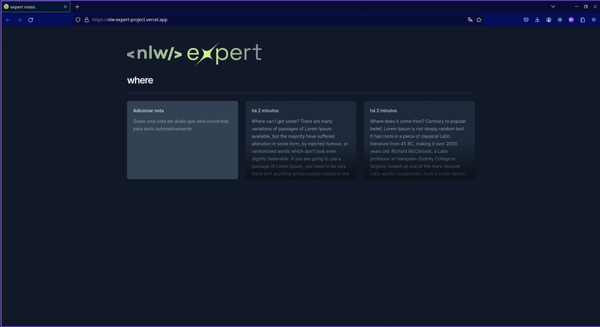

# NLW Expert

# 

Acesse: https://nlw-expert-project.vercel.app/

## Sobre o Projeto

Adicione suas notas via texto ou via voz no Notes. Projeto realizado pela NLW Expert da Rocketseat.

Sua interface visual foi desenvolvida utilizando as seguintes tecnologias:

- [React.js](https://react.dev/)
- [Tailwind](https://tailwindcss.com/)
- [TypeScript](https://www.typescriptlang.org/)
- [Vscode](https://code.visualstudio.com/)

## Para executar o projeto

- Clonar todo o repositório
- Comandos para rodar o projeto após o clone:

  ```
  npm install
  npm run dev
  ```
